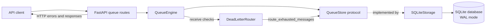
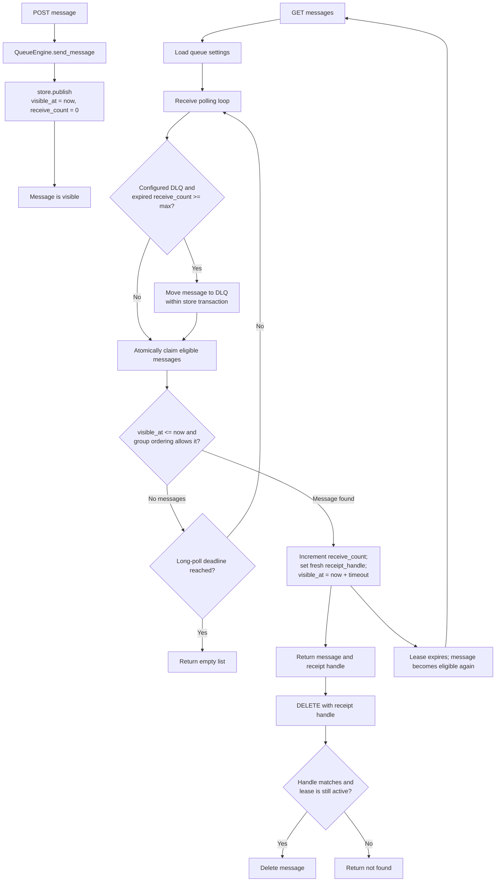
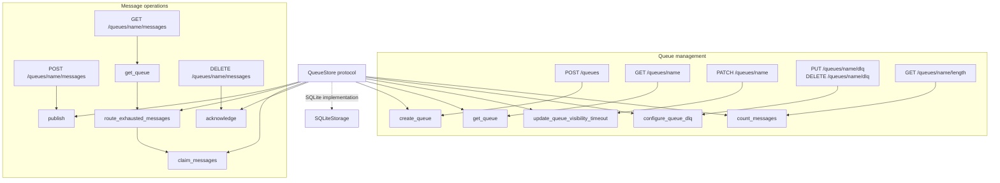

# Queue Flow Diagrams

These diagrams describe the current KinetiQ implementation. `QueueStore` is the backend contract; `SQLiteStorage` is the built-in implementation.

## Components

Routes translate HTTP requests and store errors. `QueueEngine` applies queue defaults, creates message metadata, and runs receive polling. Storage owns persistence and atomic queue operations. The DLQ router is called during receive processing and delegates the transfer to the store.

## Message Lifecycle

Receive uses the queue's visibility timeout unless the request overrides it. Long polling repeats the DLQ check and claim until a message is found or the wait deadline passes. An expired message at the retry limit is moved only when a DLQ is configured, and this happens on a subsequent receive pass. A message group cannot advance past an earlier message that is still present, including one under a visibility lease.

## Operations and Store Methods

| Store method | What it does |
| --- | --- |
| `initialize` | Creates the SQLite schema and enables WAL mode at app startup. |
| `create_queue` | Persists queue settings; validates a configured DLQ. |
| `get_queue` | Loads queue settings, including the default visibility timeout and DLQ. |
| `update_queue_visibility_timeout` | Changes the default timeout for future receives. |
| `configure_queue_dlq` | Sets or clears a DLQ and rejects missing queues or routing cycles. |
| `count_messages` | Counts every outstanding message, including leased messages. |
| `publish` | Inserts a message, or returns the existing ID for a matching queued deduplication ID. |
| `route_exhausted_messages` | Moves expired messages at the retry limit to the DLQ. |
| `claim_messages` | Atomically picks eligible messages, increments delivery counts, and issues leases and receipt handles. |
| `acknowledge` | Deletes a message only when its receipt handle is current and its lease has not expired. |